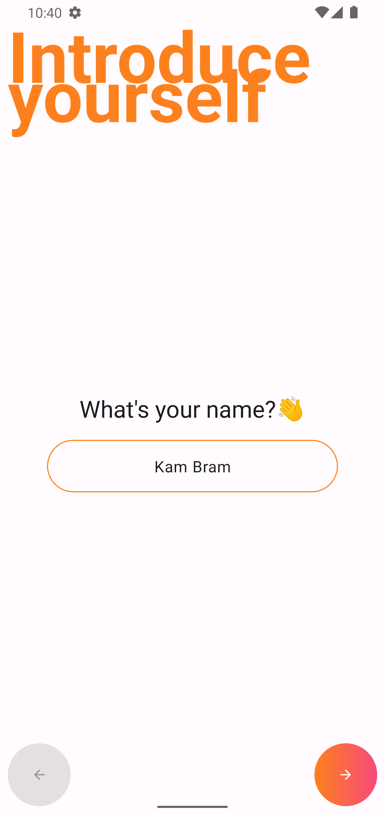

# android-dating

An example dating app created with Compose. Currently, it's just local mock data for demonstration purposes.

| Start | Register | Explore | Inbox |
| :---: | :---: | :---: | :---: |
|  |  |  |  |

## How to run

Install the APK from the [latest release](https://github.com/kdbramwell/android-dating/releases/). 

